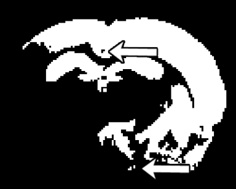

RatLesNetv2
======================

Repository of the paper "RatLesNetv2: A Fully Convolutional Network for Rodent Brain Lesion Segmentation".


### Table of Contents
* [1. Introduction](#1-introduction)
  * [1.1. Files](#11-files)
* [2. Installation and Requirements](#2-installation-and-requirements)
  * [2.1. Requirements](#21-requirements)
  * [2.2. Installation](#22-installation)
  * [2.3. Image format](#23-image-format)
  * [2.4. Setup](#24-setup)
* [3. Training and Evaluation](#3-training-and-evaluation)
  * [3.1. Training](#31-training)
  * [3.2. Evaluation](#32-evaluation)
* [4. License](#4-license)
* [5. Citation](#5-citation)
* [6. Contact](#6-contact)

### 1. Introduction
RatLesNetv2 is a convolutional neural network implemented in Python+Pytorch to segment rodent brain lesions. The code of RatLesNetv2 is simplified to make it readable and accessible to a wide audience.

This implementation of RatLesNetv2 allows combining several models trained separately. This script will generate a prediction per model and a prediction combined with majority voting. Post-processing, i.e. removing small independently connected components (holes and islands) is also available.

#### 1.1 Files

```cshell
.
 ├─eval.py # Generate and quantify predictions. It requires a file with the trained parameters of RatLesNetv2
 ├─train.py # Trains a RatLesNetv2 model. It generates the file required by eval.py
 └─lib 
   ├─DataWrapper.py # Reads and parses the NIfTI file
   ├─RatLesNetv2.py # RatLesNetv2 model implemented in Pytorch
   ├─RatLesNetv2Blocks.py # Blocks of RatLesNetv2 (Bottleneck and ResNet)
   ├─losses.py # Cross Entropy + Dice Loss functions
   ├─metric.py # Metrics to quantify segmentations quality i.e. Dice coeff., Hausdorff distance, Islands
   └─utils.py # Other functions.
```

### 2. Installation and Requirements

#### 2.1 Requirements
 * [Python](https://www.python.org/downloads/) (preferably version 3). Programming language of RatLesNetv2.
 * [PyTorch](https://pytorch.org/get-started/locally/) (preferably with GPU support). Deep Learning framework.
 * [pip](https://pypi.org/project/pip/). Python package installer.
 * [Virtual Enviroment](https://packaging.python.org/guides/installing-using-pip-and-virtual-environments/) (optional)

#### 2.2 Installation

0. Install all libraries from 2.1 Requirements

1. Install dependencies with pip
```cshell
pip install scipy, scikit-image, nibabel
```

2. Download source code
```cshell
git clone git@github.com:jmlipman/RatLesNetv2.git
```

#### 2.3 Image format
 * RatLesNetv2 uses [NiBabel](http://nipy.org/nibabel/) library to open scans. The recommended (and tested) input files are compressed NIfTI files (i.e. scan.nii.gz). If you want to convert Bruker files to NIfTI files, you can use [Bru2Nii](https://github.com/neurolabusc/Bru2Nii).
 * Images and their corresponding labels must be in the same folder (check below the expected path structure)
 * Images must have the following 4 dimensions: Height x Width x Depth x Modality (our images were 256x256x18x1). 
 * Labels will have values of 0 (background voxels) and 1 (lesion voxels) in 3 dimensions: Height x Width x Depth.

Example of path containing training data:
```cshell
PATH
 └─Study 1
   └─24h (time-point)
     ├─32 (id of the scan)
     │ ├─scan.nii.gz (image)
     │ └─scan_lesion.nii.gz (label)
     └─35
       ├─scan.nii.gz
       └─scan_lesion.nii.gz
       ...
```

#### 2.4 Setup
 * By default RatLesNetv2 expects NIfTI files with 1 single modality. You can change this number by editing the content of the variable `modalities`.
 * The name of the scans and the ground truth are expected to be **the same** across each acquisiton. In the path example described in [2.3. Image format](#23-image-format) the names are "scan.nii.gz" and "scan_lesion.nii.gz". You can change this name in lib/DataWrapper.py `self.scanName` (images) and `self.labelName` (labels).

### 3. Training and Evaluation

#### 3.1 Training
Arguments within \[brackets\] are optional.

```cshell
python train.py --input DIR --output DIR [--validation DIR --loadMemory -1 --gpu X]
# Example
python train.py --input ~/data/in/MRI_Training_Data --output ~/data/out/Trained_Models --validation ~/data/in/MRI_Validation_Data --loadMemory 1
```

* --input: Path containing all the subfolders of the data used for training/optimizing the network. Check [2.3. Image format](#23-image-format) to see the expected path structure.
* --output: Path or name of the folder where the output files will be saved (trainin_loss, validation_loss, RatLesNetv2.model).
* --validation: Path containing all the subfolders of the data used for calculating the validation error. Check [2.3. Image format](#23-image-format) to see the expected path structure.
* --loadMemory: If 1, it will load into memory (RAM) the training and validation files. This will speed up the training since the script will not constantly open and close the same files. However, if too much data is used it may not fit into the RAM. In our case, 24 MRI scans use around 2GB of memory.
* --gpu: This will choose the GPU. Leaving this by default will make RatLesNetv2 use the default GPU (if any). It is **highly recommended** to use a GPU to train RatLesNetv2.

Files generated by train.py:
* training_loss: it contains the loss calculated during the training.
* validation_loss: it contains the loss calculated during the validation. This file is generated if --validation option is used.
* RatLesNetv2.model: parameters of RatLesNetv2 after the optimization/training. **This file is necessary to generate the predictions by the eval.py script**.

#### 3.2 Evaluation
Arguments within \[brackets\] are optional.

```cshell
python eval.py --input DIR --output DIR --model FILE [--gpu X]
# Example (evaluating with 1 model)
python eval.py --input ~/data/in/MRI_Testing_Data --output ~/data/out/Segmentation_Results --model ~/data/out/Trained_Models/1/RatLesNetv2.model [--gpu X]
# Example (evaluating with multiple models)
python eval.py --input ~/data/in/MRI_Testing_Data --output ~/data/out/Segmentation_Results --model ~/data/out/Trained_Models/*/RatLesNetv2.model [--gpu X]
```

* --input: Path containing all the subfolders of the scans that RatLesNetv2 will segment. Check [2.3. Image format](#23-image-format) to see the expected path structure.
* --output: Path or name of the folder where the output files will be saved.
* --model: Location of the parameters of RatLesNetv2 after the model was optimized. It is the file generated by train.py called RatLesNetv2.model.
* --gpu: This will choose the GPU. Leaving this by default will make RatLesNetv2 use the default GPU (if any). It is **highly recommended** to use a GPU to train RatLesNetv2.

Files generated by eval.py:
* A segmentation file per scan found in the --input
* If the folders where the scans are located also contain the ground truth (following the same structure in [2.3. Image format](#23-image-format) ) a file called stats.csv with the Dice coefficient, Hausdorff distance and Number of Islands will be generated.

Enable/Disable Post-processing:

Post-processing is a final step that removes small "holes" and "islands" in the segmentations generated by the model (see Figure below). You can choose the threshold which determines that a hole/island is too small and it will be removed. By default this value is 20. In other words, clusters of voxels smaller than 20 will be removed.

```cshell
# eval.py
removeSmallIslands_thr = 20
```



### 4. License
[MIT License](LICENSE)

### 5. Citation
"RatLesNetv2: A Fully Convolutional Network for Rodent Brain Lesion Segmentation"
Pre-print available: https://arxiv.org/abs/2001.09138

### 6. Contact
Feel free to write an email with questions or feedback about RatLesNetv2 at **juanmiguel.valverde@uef.com**
